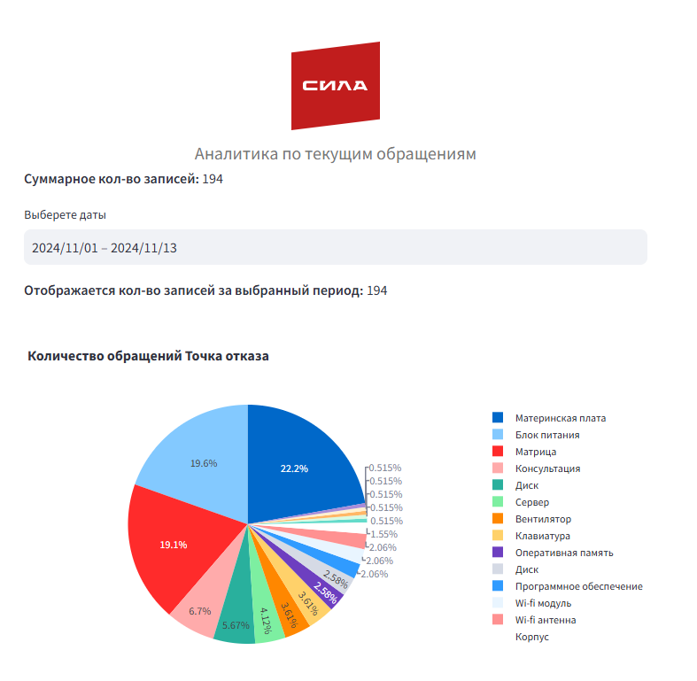

# Решение кейса Автоматическая диспетчеризация заявок Цифровой Прорыв

## Структура решения
```
project/
│
├── st_web_up/
│   ├── __init__.py              
|   ├── db.py                     # Реализация базы данных
│   ├── streamlit_app.py          # Основной файл для запуска Streamlit приложения
│   ├── create_appeal.py          # Функции для создания обращений и их обработки
│   ├── analytics.py              # Функции для отображения аналитики
│   ├── configs.py                # Конфигурация приложения
│   ├── st_styles/
│   │   └── base.py               # Стили для Streamlit
│
├── app/
│   ├── classifier
│   │   ├── extract_series_number.py # Извлечение серийного номер
|   |   ├── keywords.py              # Ключевые слова для модели
|   |   ├── model.py                 # Релизация Модели
|   |   ├── pipeline.py              # Пайплайн извелечения всех атрибутов
│   ├── __init__.py
│   ├── main.py                  # Основной файл API
│   ├── models.py                # Модели данных для запросов и ответов
│   ├── config.py                # Конфигурация сервиса
│   ├── response_generator.py    # Логика обработки обращения

```
## Установка зависимостей
```
python -m venv venv
venv/Scripts/activate
pip install -r requirements.txt
```
## Запуск сервисов
1. Запуск FastAPI сервиса для обработки обращений  
```
uvicorn app.app:app --reload
```
2. Запуск web user interface
```
streamlit run st_web_ui/streamlit_app.py
```
## API Документация

### Введение

Этот API предоставляет функциональность для генерации данных на основе введенной темы и описания. API принимает запрос с данными, обрабатывает их и возвращает сгенерированные результаты.

### Основной маршрут

#### `POST /generate`

Этот маршрут позволяет пользователю отправить данные с темой и описанием для их обработки и получения сгенерированного ответа.

#### Запрос

**URL**: `/generate`  
**Метод**: `POST`  
**Тело запроса**: JSON-объект, соответствующий модели `InputData`.

**Модель `InputData`**:
```json
{
  "topic": "string",         // Тема обращения (строка)
  "description": "string"    // Описание обращения (строка)
}
```
#### Ответ
**Статус:** 200 OK
**Тело ответа:** JSON-объект, соответствующий модели ResponseData.

**Модель `ResponseData`**:
```json
{
  "created_at": "string",       // Дата создания (строка)
  "status": "string",           // Статус обращения (строка)                 
  "topic": "string",            // Тема обращения (строка)
  "description": "string",      // Описание обращения (строка)
  "device": "string",           // Тип устройства (строка)
  "failure_point": "string",    // Точка отказа (строка)
  "serial_number": "string"     // Серийный номер устройства (строка)
}
```
#### Пример запроса
```json
{
  "topic": "Ошибка при включении устройства",
  "description": "Устройство не включается после обновления ПО."
}
```
#### Пример ответа
```json
{
  "created_at": "2024-10-11 12:14:30",
  "status": "To Do",
  "topic": "Ошибка при включении устройства",
  "description": "Устройство не включается после обновления ПО.",
  "device": "Ноутбук",
  "failure_point": "Блок питания",
  "serial_number": "CH2200202"
}
```
#### Ошибки
* 400 Bad Request: Если запрос не содержит всех обязательных полей.
* 500 Internal Server Error: Если произошла ошибка на сервере.
